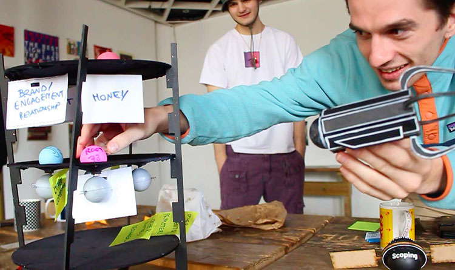

Multiverse Innovation is a method and an open platform designed for social innovators, whether as individuals or organisations. It supports the modelling process of complex power dynamics, existing within societal structures.

From that new understanding, innovators can tackle their challenge in a new radical and sustainable way. Through its playful and physical probes, Multiverse Innovation finds its best application in helping organisations go through transitions and change processes.

