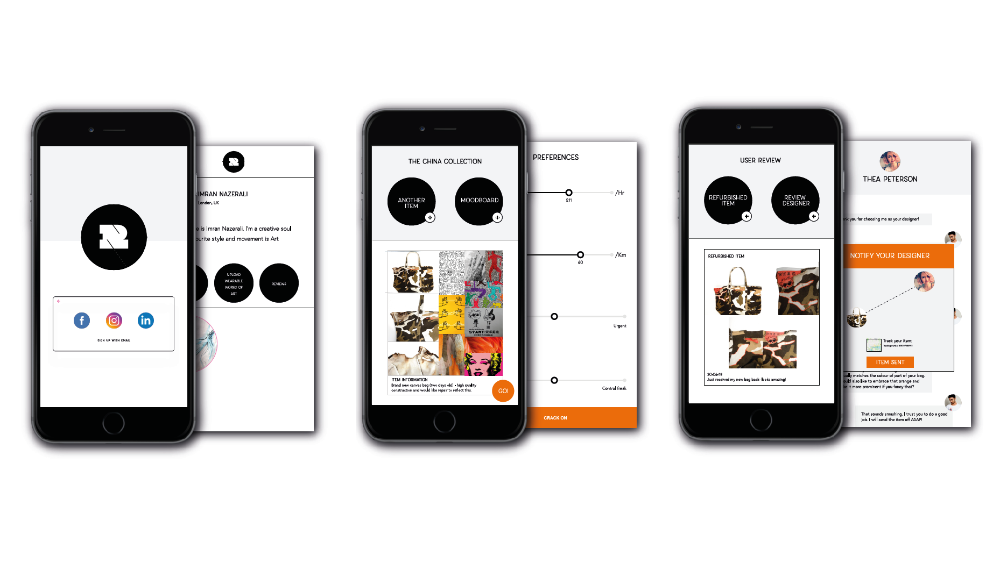
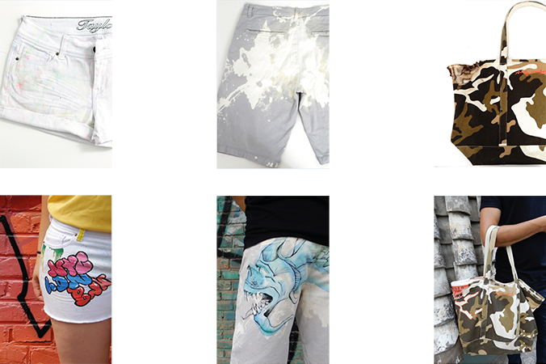

RUINS is a service platform connecting users with local designers, tailors, students
and do-it-yourselfers, who will refurbish old clothing so you don’t have to discard or replace it. Tying into the sentimentality and nostalgia people have for their old loved items, Ruins aims to help you personalize and embrace the broken, stained, or just plain boring items in your closet.

Ruins’ designers take inspiration from personalized mood boards users generate in the platform to create wearable works of art you’ll want to keep in your closet for years.

