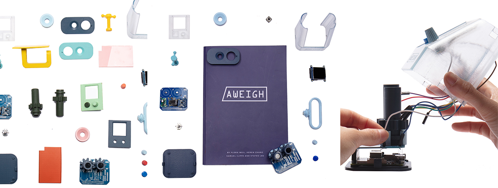
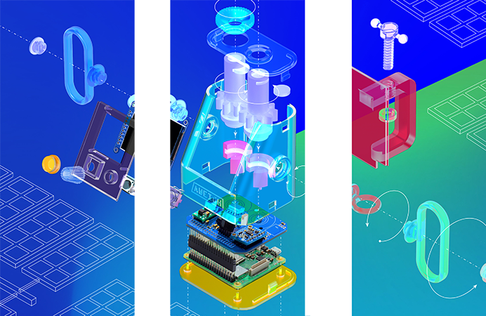

Aweigh is an open navigation system that does not rely on satellites: it is inspired by the
mapping of celestial bodies and the polarized vision of insects.

Ancient seafarers and desert ants alike use universally accessible skylight to organize, orient, and place themselves in the world.

Aweigh is a project that learns from the past and from the microscopic to re-position individuals in the contemporary technological landscape.

Networked technologies that we increasingly rely on undergo changes that are often beyond our control.

Aweigh is a set of tools and blueprints that aims to open modern technologies to means of democratization, dissemination, and self-determination.

These tools were designed to depend only on publicly available materials and resources: digital fabrication machines, open-source code, packaged instructions, and universally accessible sky light.

Aweigh is inspired by ancient navigation devices that use the process of taking angular measurements between the earth and various celestial bodies as reference points to find one’s position.

Combining this process with the polarization of sunlight observed in insect eyes, the group developed a technology that calculates longitude and latitude in urban as well as off-grid areas.

