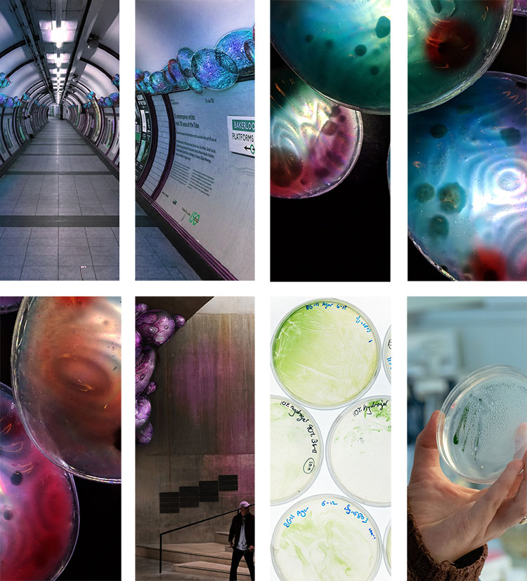

With increasing urbanization, we’re faced with an urgent crisis, the air in our cities is becoming increasingly toxic.

CELLUL-AIR joins the fight for clean air in a new, visual way,
powered by microbes.

In the coming decades, many more people will fall victim to chronic respiratory illnesses, stroke, and heart attacks because of dirty urban air. 91% of us live in spaces exposed to air pollution that exceeds World Health Organization limits. Moreover, air pollution is the single biggest killer in the world, causing up to 4.2 million deaths each year.

It’s easy to see the urgency of the problem, yet it is hard to see real action taking place to combat it.

Traditional air cleaning systems are unattractive, dysfunctional, and often forgotten about. The battle against air pollution is happening now and CELLUL-AIR brings that brawl out into the streets for everyone to see.

Using the principle of bioremediation, CELLUL-AIR is a new air filtration system that takes in urban air and breathes out clean, purified air.

Bioremediation involves using microbes that naturally absorb and transform noxious pollutants. CELLUL-AIR uses specific species to help transform the dirty air we’re breathing in our cities.
