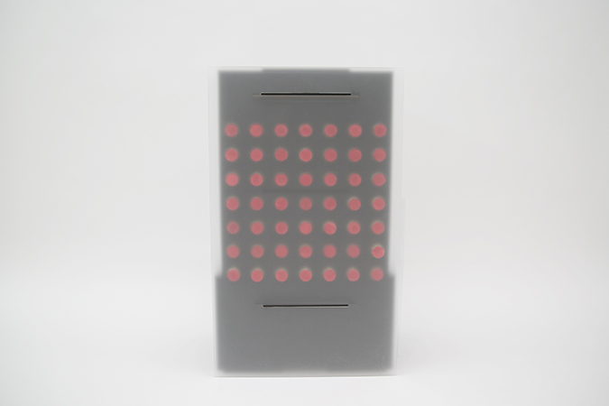
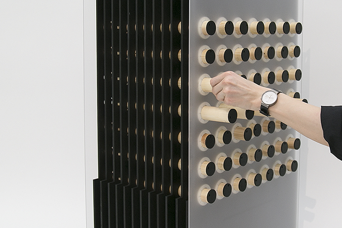

	
	
	
  
  
  

Inspired by British mathematician Alan Turing's machine "Enigma", I keep the features of that machine and make a editable chair. The front side is the dial plate matrix that you can rotate and pull/push to adjust the length of each stick. The other side is signal matrix which could be a reflection of your chair.
