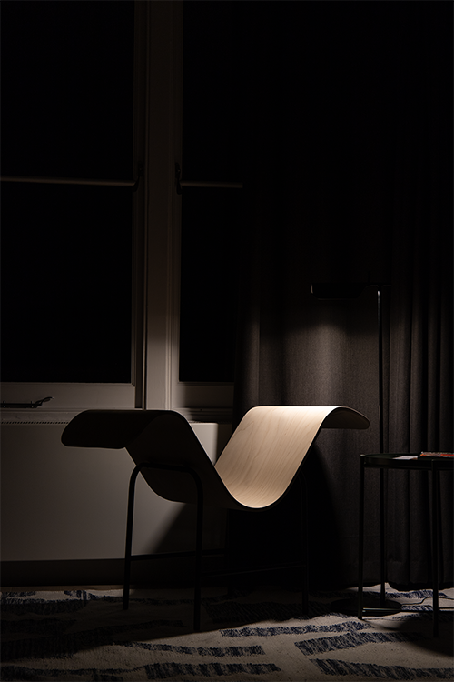

The 65 Reading Chair is designed to place the user in a reading position that many of us are familiar and comfortable with: sideways on a sofa, leaning against the armrest. The chair draws from our instinctive behaviours and questions conventional "ergonomics". The number 65 comes from the angle between the upper and lower body when sat in the chair. It is made from birch plywood and steel tube.
