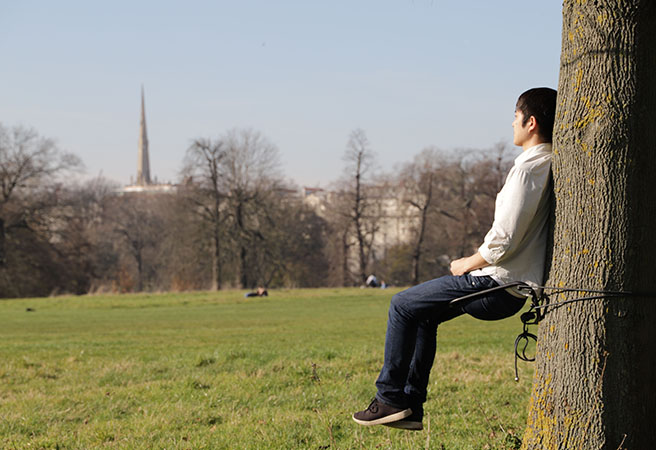
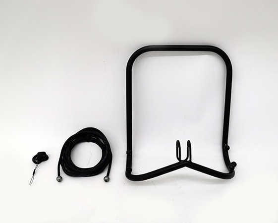

Polypore is the chair provides a new viewpoint for sitting with making the space on the trunk of trees. In particular, I looked into the distance between users and nature, as well as making it closer through the experience of "finding their own space" and "feel the trunk on the back".

