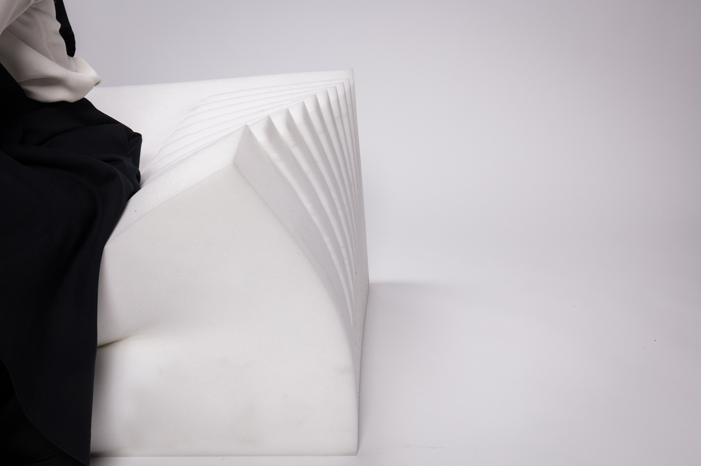

	
	
	
  
  

Superfoam is made by a huge middle-density foam. Its bottom was hollowed out and edge was cut but outside still keep the shape. When people sit down, the gravity will let the edge change and show its aesthetic. Superfoam shows the characteristics of a huge foam in a Minimalism style.
