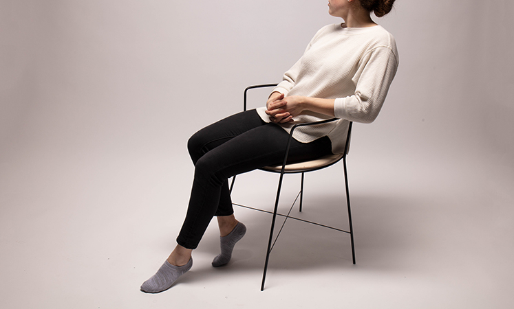

	
	
	
  
  

A chair investigating subtle motion in positive and negative space. Swirl was constructed by hand using wood and steel fabrication techniques. The design of the seat is a cumulation of a material investigation of plywood. Originally inspired by the relationship between the user and chair, Swirl grew to a refined minimal expression of lightness.
