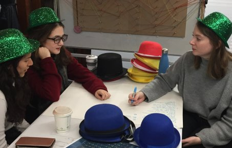

Addressing the global economic, social and environmental challenges requires  deploying innovation and creativity at all levels of the society to ensure effective solutions to systemic problems .

 The Innovation, Creativity and Enterprise research theme  seeks to understand the structure and impact of creativity and innovation processes across different disciplines, organisations and sectors in order to design effective solutions to tackle complex problems.

 We are developing innovation methodologies, theories and creative tools to address problems such as environmental pollution and design of circular business models, as well as insights into creative processes such as collaborative design, design futures and creative leadership routines supporting continuous innovation. We work closely with design focused enterprises across the manufacturing, creative and environmental sectors.
