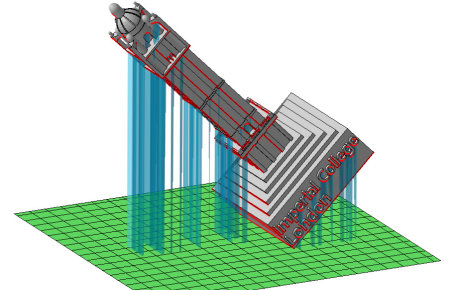

As global manufacturing systems move towards Industry 4.0 it is vital that we are equipped with the knowledge and skills necessary to harness its full potential. The Manufacturing theme is doing this through developing advanced CAE, innovative material processing and digital manufacturing processes. The theme covers a broad range of length scales from material synthesis and characterisation, to manufacturing technology development, and system implementation. Currently, the main active research areas are:

* Low carbon transport facilitated by lightweight structural design
* Innovative material processing technologies
* Design for additive manufacture
* Development of bio-printing technologies

# Research projects
## Mass Customisation of Bespoke Additive Manufactured Personal Equipment through Parametric Design
#### Shiya Li

Mass Customisation (MC), an oxymoron that means delivering customised goods and services to consumers at the efficiency of mass production. It can bring substantial benefits for consumers and businesses alike. Unfortunately, the realization of true MC has not been easy due to the limitation of traditional manufacturing technologies. Additive Manufacturing (AM) has been identified as a key enabler of MC due to its negligible tooling costs associated with producing one-off items. The challenge remains to scale up the production while keeping costs low. This PhD aims to bring down the prohibitive AM design cost through replacing its highly knowledge- and labour-intensive design process with a fully automated pipeline. Case studies include, craniofacial personal equipment such as medical breathing masks and eyewear. This work aims to make AM more accessible for businesses, thus bringing true mass customisation to the general public.

## The Tribological behaviour of 3D Printed Metals
#### Mohanad Bahshwan

In partnership with the Department of Mechanical Engineering,  Tribology Group.  This PhD involves multi-disciplinary research in metal Additive Manufacturing and Tribology (friction, lubrication, and wear).  Understanding the tribological properties of materials is of extreme importance in complex systems involving many moving parts (automotive, aerospace, medical implants) as friction and wear lead to decreased system efficiencies and shorter components lifespan.  Thanks to AM, parts with complex geometries and embed functions can be produced.  However, the tribological properties of AM components have not been explored in-depth.  Mohanad is utilizing Selective Laser Melting (SLM) technology to investigate the possibility of altering the tribological properties of commercial 316L stainless steel by changing the SLM process parameters.  Utilizing advanced imaging techniques such as Scanning Electron Microscopy and Electron Backscatter Diffraction to characterize the complex microstructure induced by SLM manufacturing.

## Structurally optimized bio-receptive materials via Additive Manufacture
#### Livia Kalossaka

Through a bionic approach - combining properties of the synthetic and natural world - it is envisaged that a sustainable way to create smart materials can be developed. The aim of this research is to combine chemistry, design and manufacturing to create structurally graded materials that can promote natural growth. By developing such bio-receptive materials it is envisaged that natural growth patterns can be tuned to the desire of the user. Such materials which harness the power of biological constructs could then be applied to different fields  such as construction materials, tissue regeneration and agriculture.

## The effect of internal structure on the shape memory effect of shape memory polymers
#### Jiwoo Choi

The use of Shape Memory Polymers with Additive Manufacturing has become known as 4D Printing due to the addition of ‘time’ as an extra dimension. SMP objects can be designed to move or morph along a designed path so that complex motion paths can be achieved and a whole range of functions carried out. This PhD is investigating the potential to control the shape transformation behavior through altering the internal structure of objects without compromising the external geometry. The work aims to make SMP technology more accessible to industry, as design constraints are not compromised and a greater level of control of the shape memory effect can be achieved within the limited material library.

## Development of a novel intra-stereolithography Bio-Printing process
#### Borut Lampret

Current Bio-Printing methodologies are limited to the creation of cell cultures and scaffolds that allow cellular material to grow within them to create tissue-like structures. These simple materials lack sophistication, are non-functionalised and are reliant on the scaffold to determine mechanical properties. In comparison, biological materials such as cartilage, are functionalised hierarchical structures with graded mechanical properties tuned to a specific task. As yet, 3D printing has not been able to match nature's ability to create such structures. This project aims to develop a novel 3D printing method, that combines synthetic biology and opto-genetics to stimulate cell activity using external inputs. Focus is on developing the advanced optical methods needed to control the light signals (wavelength and intensity) at precise locations within the 3D matrix. Illuminating a precise spot within a gel matrix presents several challenges, including (but not limited too) diffraction and dispersion of the illuminating beam, as well as achieving the required intensity without causing deleterious effects on the surrounding matrix material. A successful outcome is a system that can 3D print an object of a desired design repeatedly with high accuracy.
