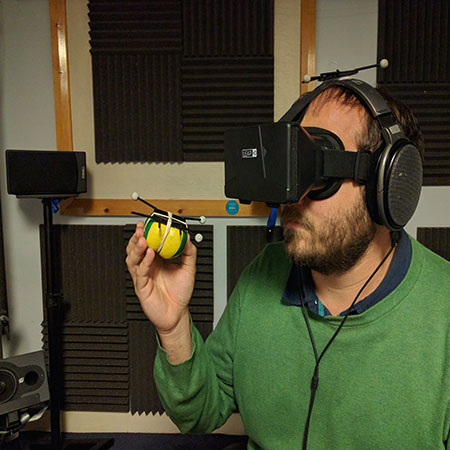
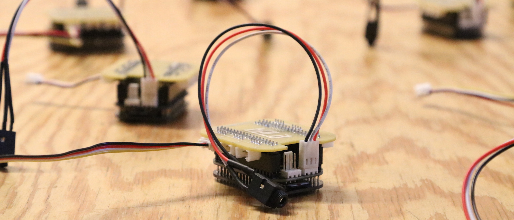

{:height="50%" width="50%"}

The Audio Experience Design theme includes researchers and projects in areas related with both the physical and the perceptual natures of audio, with particular focus on sonic interaction and user experience. Currently, the main active research areas are:

* Spatial hearing and binaural audio
* Wearable embedded interactive audio systems
* Audiology and hearing devices

We put particular attention towards applications and the impact of our research, aiming at both developing novel technologies and techniques, and at using them to improve the quality of life for end users through how they experience audio interfaces. In order to fulfill these aims, we work closely with several companies and institutions, from hearing aid manufacturers to artistic production companies, from hospitals to national and international research centres.

# Research projects
## Smart Arse: Bespoke E-Textile Trousers
#### Sophie Skach (Queen Mary University of London)
#### Rebecca Stewart (Audio Experience Design, Imperial College London)
The tailor made ‘smart’ trousers shown here are designed to capture a variety of body movement and social signals in human conversation.

This is accomplished by unobtrusively embedding textile pressure sensors around the legs, measuring postural movement and self touch.

These custom made pieces will be on display and visitors are invited to interact with them and explore the materiality - conductive fabrics linked with electronic components.

## Interactive 3D Audio Over Headphones for Mobile and Wearable Devices
#### Rishi Shukla (Queen Mary University of London)
#### Rebecca Stewart (Audio Experience Design, Imperial College London)

This system generates interactive 3D sound scenes using a microcomputer small enough to fit inside a tennis ball.

The device presents multiple sources in virtual surround sound locations over headphones using a method known as binaural synthesis. By incorporating realtime head-tracking, sound sources retain their virtual position in space relative to the listener’s head movement.

The implementation fuses a variety of digital signal processing techniques to deliver highly portable and interactive spatial sound, which can potentially be used to power audio-based augmented experiences.

## 3D Sound Localisation in Virtual Reality
#### Isaac Engel (Audio Experience Design, Imperial College London)
#### Lorenzo Picinali (Audio Experience Design, Imperial College London)

Humans localise sounds by (unconsciously) analysing tiny differences between the left and right ear signals, as well as directiondependent spectral information.

In Virtual Reality (VR), we can emulate such cues and effectively trick the brain into perceiving sounds at a given location, even if they are actually played through headphones.

In this exhibit, you can test and train your sound localisation skills in a VR game.

## The 3D Tune-In Toolkit
#### Isaac Engel (Audio Experience Design, Imperial College London)
#### Craig Henry (Audio Experience Design, Imperial College London)

{:height="50%" width="50%"}

This exhibit showcases the 3D Tune-In Toolkit, which is an open source tool for audio spatialisation and simulation using headphones.

The Toolkit allows the design and rendering of highly realistic and immersive 3D audio, and the simulation of virtual hearing aid devices and of different typologies of hearing loss.

Project link: http://www.3d-tune-in.eu/

## Plugsonic - 3D Soundscapes for Cultural Heritage
#### Marco Comunità (Audio Experience Design, Imperial College London)

Pluggy is a EU project developing a social platform for cultural heritage awareness and
participation. To create engaging experiences, technologies like augmented reality, 3d sound, geolocation and games are being used.

The exhibit will showcase PlugSonic - a series of web and mobile apps designed to create and navigate 3D soundscapes.

## 3D Acoustics for Audio Monitoring of Rainforest Biodiversity
#### Beck Heath (Audio Experience Design, Imperial College London)
#### Sarab Sethi (Audio Experience Design, Imperial College London)
This exhibit will describe the audio research currently happening at the SAFE project in Borneo and what integrating the system to 3D might help.

The exhibit will include an immersive VR forest soundscape with a headset for people to explore.
