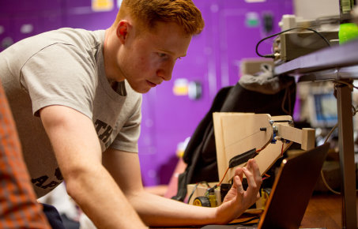

Global challenges invariably require behavioural change, whether direct or indirect, in order to effect lasting solutions. Such challenges may be concerned with addressing health issues, furthering sustainability, or creating future digital economies. A deep understanding of people residing at the core of these problems is necessary to produce human-centred products, experiences, systems, services, decision-making procedures and design processes.

Researchers in the Behaviour, Experience and Design theme seek to understand human motives, behaviour and decision-making processes when researching products, experiences, services and systems, utilising a human-centred approach.

These activities focus on a wide range of applications, such as understanding patients’ behaviour and decision-making when non-adhering to medication; understanding human emotional and cognitive processing within human-robot interactions, or designing behavioural interventions to help foster sustainable behaviours and improve outcomes, such as quality of life of end users. In order to fulfil these aims, we work closely with companies, start-ups, charities, government bodies and institutions, various hospitals and national and international research centres.
