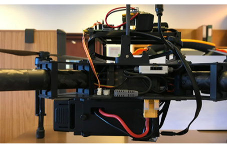

The Cyber-Physical Systems (CPS) theme integrates computation with physical systems and processes combining sensing, actuation and control with networking, machine intelligence, and ultimately, people. Designing trustworthy and reliable CPS requires new ways to design systems embedding connected sensors and actuators that monitor and control their physical environments; intersecting numerous established research areas from microelectronics to control to Internet computing.

Understanding how to design CPS to extract value from data and enable new services while mitigating threats to users’ privacy or weakening security is of particular interest, and topics including security, privacy and trust in the Internet of Things era are central to our research. We are also interested in smart textiles and wearables, communications, autonomy, control and energy design. These topics are linked to a wide range of application scenarios like intelligent spaces (e.g. future living, transport and work environments), enabling large-scale non-invasive user studies, and distributed monitoring in extreme environments incorporating unmanned aerial vehicles and wireless sensors.

We collaborate with many research groups across Imperial College London and with industrial partners, government agencies, regulators, charities and healthcare providers.
