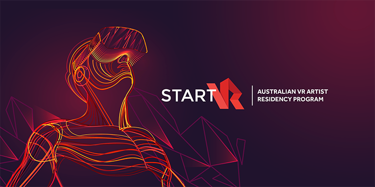

Since the first VR headset was introduced to the public, designers have been pushing the boundaries of 3D experiences. From hyper realistic environments to Sci-Fi utopias, the VR community has seen an exponential growth in experiences. However, UI’s are still commonly kept to 2D interfaces displayed around the user. The few designers who have dared to explore the power of 3D interfaces have create memorably empowering experiences. This project aims to further explore this, while paving the path for future VR designers. How can the power of 3D interfaces enhance VR experiences? What are the fundamental principles needed to effectively design such interactions?
