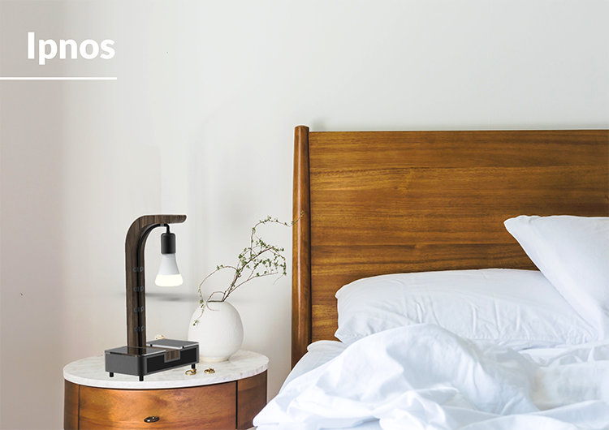

Healthy sleep, both in terms of length and quality, is critical to our physical, mental and social wellbeing. Ipnos is a non-invasive, smart-home integrated system for providing improved sleep quality. The system comprises environmental monitoring, sleep-stage tracking and environmental actuation. It is compatible with smart lighting (Philips Hue) and smart thermostat (Nest) appliances. The bedside product is the embodiment of this system, designed for the consumer market and enabling long-term health monitoring and enhancement within the comfort and familiarity of the user’s home.
