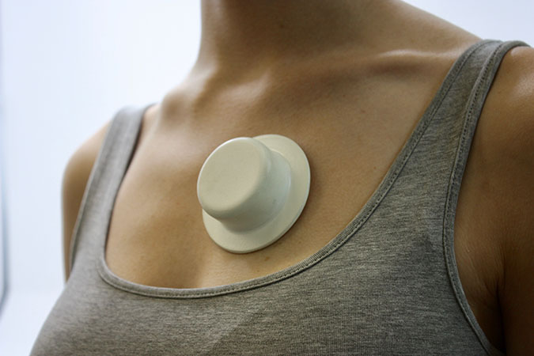

Afflo is an AI-enabled wearable monitor to track and record asthmatic symptoms and triggers. Respiratory audio signals are collected through a microphone mounted on the patients chest in the Afflo Wearable. Environmental information is collected through a sensor bundle, the Afflo
Pod. These two streams of data are analysed using Artificial Intelligence to make predictions about each patient’s personal triggers. This is presented back to the user through the Afflo Mobile Application, allowing them to make decisions to minimise their asthmatic symptoms. This end-to-end system takes the guesswork out of trigger diagnosis.

For detailed design engineering process, please visit https://www.annabernbaum.com/afflo
