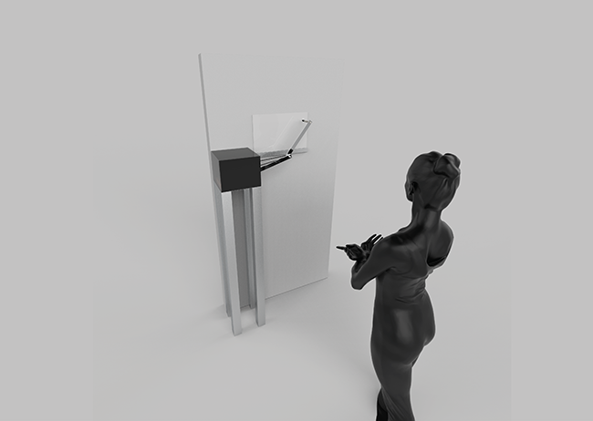

The project is centred around an “artefact”, an anthropomorphic robotic arm, which responds to movements from a spectator, representing their movement through abstract traces on a piece of paper. Art blanche also proposes a methodology, a series of steps to aid in the ideation and documentation of design decisions in the development of interactive machines.
