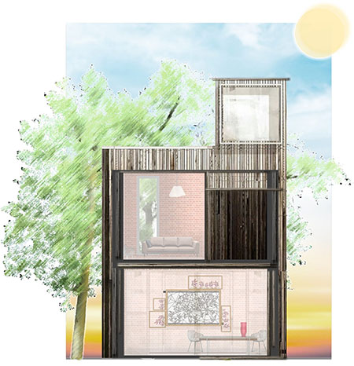

We need to remove 1 trillion tons of carbon dioxide from the atmosphere. Plants are powerful. If we promote plantation and restore both our land and the 71% of Earth’s oceans then we may be able to begin this carbon capture reach. Growing art from plant roots and microbes could act as a carbon storage production system. The future home must ensure for our health and wellbeing. Outdoor and indoor air pollution is a continuing problem. Art has been in our homes for centuries. Living art that houses plants and grows their air purifying roots through it can clean our air and when fully developed, produce customisable new plant based materials and textiles ready for further application.
