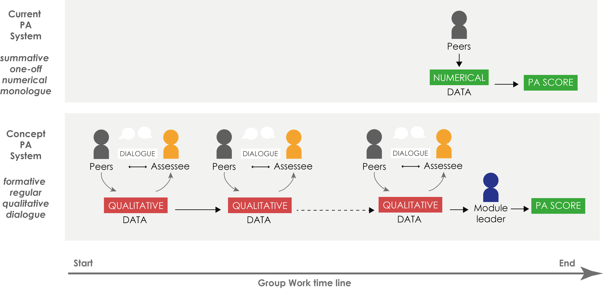
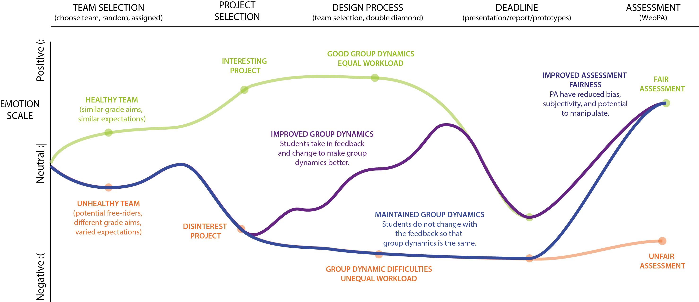
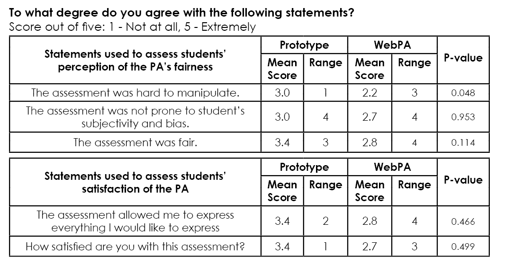
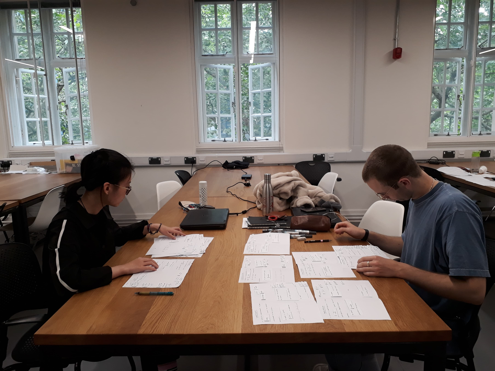

## Summary

Unequal distribution of work is one of the key causes of a negative learning experience for students working in groups. The existing WebPA system in Meng Design Engineering is prone to bias, subjectivity, and manipulation, making it unfair. This project aims to improve university students’ learning experience in group design work through designing a peer assessment (PA) system that focuses on learning as opposed to assessing. In testing, it was observed that students want to be able to share qualitative feedback with each other. The findings can contribute future developments of fair PA systems and the department’s pedagogy transformation.

## Introduction

This report’s study is motivated by group design projects in the four-year MEng Design Engineering programme in the Dyson School of Design Engineering in Imperial College. A group design project is usually student-led and involves students working together through the design process to produce an innovative outcome. Due to group projects being open-ended and prevalent in the programme, the challenges of working in a team are amplified. 

The aim of this study is to improve the learning experience of group design work so that students can fully benefit and learn from participating in group work.  According to the MEng Design Engineering programme specification (2018), by the end of the programme, students should be able to  “Demonstrate individual responsibilities of managing and contributing in effective and diverse teams”, and hence, there is a need for students to learn effectively from group projects. Dyson School of Design Engineering is planning for a pedagogy transformation of its Design Engineering modules, which seeks to improve upon project-based learning activities. Findings of this study may contribute to the pedagogy transformation and ultimately improve students’ learning experience. 

## Current Solution & Challenges
Like other universities, the Dyson School of Design Engineering uses Loughborough University’s (2005) Web Peer Assessment (WebPA), which is an online peer assessment system, to allocate individual marks in groups. Tutors and teachers typically do not monitor a group’s progress and do not have enough information to provide individual marks. Peer assessment (PA) solves this. It makes individuals accountable for their work in a group. It can be seen as one of the best ways to discourage free-riding. It also has many learning benefits, such as the development of responsibility, maturity, confidence and social skills, as well as better student performance in general due to the exposure to new ideas. PA also promotes autonomous, reflective and independent learning.

Even though a PA system exists in the programme, more than 40% of DE students surveyed were unhappy with the WebPA. Findings suggest that the dissatisfaction with peer assessment is due to its inability to represent unequal efforts, and that the main flaws of WebPA were proneness to bias, subjectivity, manipulation, and lack of feedback. 

## Aim
PA's similarity to a zero-sum game can be seen as one of the reasons for unfairness in the system. A zero-sum game is where ones' loss is equivalent to another's gain. The allocation of marks in PA can be seen as the giving of punishments and rewards. This motivates and supports the key concept behind the proposed PA in this study: developing a non-zero-sum PA so that students would no longer be tempted into competition and dishonesty, and would perceive the PA as more fair. 

## Proposed Solution
The proposed solution was to make the PA learning-focused as opposed to assessment-focused. This means that students would be less inclined to be biased since they would see PA as a learning tool, where it is a win-win situation, not as an assessment tool, where it is a win-lose situation. The new learning-focused PA concept developed  is summarised in the diagram below. 

The key features of the assessment are described below.

* Formative assessment, as opposed to summative assessment, removes students’ direct ability to assign losses and gains, and in so doing reduces students’ temptation to be biased (Sqidharan & Boud, 2019) and  their reluctance to mark others down (Race, 2001).

* Qualitative data collected from assessments provide students with a better understanding of how to improve (Collis et al, 2015). It was suggested that qualitative data could be used to justify the numerical assessment. However, since the numerical component does not provide additional constructive feedback, and may encourage students to view PA as simply a marking tool, the numerical component is excluded. 

* Multiple evaluations during the group project allow instructors to intervene if necessary before the project ends. It also provides underperformers an opportunity to modify behaviour as necessary, allow learning progress to be recorded, and create the habit of self reflection. To avoid the discomfort of confrontation for the assessors, the peer feedback should remain anonymous.

* Two-way dialogue between the assessor and assessee (as opposed to a one-way transfer of information) makes feedback more effective. It provides an opportunity for assessees to defend themselves if feedback is unjust, bias, or unclear, and allows for discussions on correcting possible misunderstandings.

<iframe width="560" height="315" src="https://www.youtube.com/embed/q2CoDUWztOs" frameborder="0" allow="accelerometer; autoplay; encrypted-media; gyroscope; picture-in-picture" allowfullscreen></iframe>

## Testing & Impact
The main potential human impact of the concept is illustrated in the purple and blue paths on the journey map below, overlaying the orange and green paths shown in the figure. The green path indicates a positive student experience and the orange path indicates a negative student experience. The blue path shows how the concept can redirect the negative (orange) path to a positive assessment experience. This is done through reducing potential for manipulation, bias and subjectivity, which makes students’ perception of PA more fair. The purple path is a variation of the blue path to show how group dynamics can potentially improve and make students’ learning experience better as students take on constructive feedback from each other. 

### Method
A Google Spreadsheet prototype of a PA with an anonymous qualitative feedback system, which is a simplified version of the proposed concept, was created. The regularity (i.e. multiple assessments), formative and dialogue aspects of the concept could not be tested due to time constraints. 

Seven final year Design Engineering students from two different project groups participated in the test. The groups were from the Enterprise Roll-Out (ERO) module, an academic-year-long module. This test was done after the last deadline of the module to avoid participants from feeling stressed. Students were offered food and drinks for compensation. Participants spent approximately 30 minutes on the test. The proposed PA was explained to team members. They were asked to assess each team mate and themselves. Afterwards, they were asked to select two comments, a positive comment and an area for improvement. These comments were shared anonymously to the people and everyone got to read their own assessment results. In the end, they were sent a Google Form to fill in about the assessment. Appendix I shows the Google Form questions and results from the test.

### Results
On average all aspects of the prototype scored greater than or equal to three, which are larger than the mean score for the WebPA. The test score range is consistently less than or equal to the WebPA range. At a glance, the prototype’s test result seems better than the WebPA’s in terms of students’ perception of fairness and their satisfaction of the PA. Using an unpaired non-parametric test due to low sample size and the participants for both tests being different, a Mann-Whitney U test was applied and the p-values for each quantitative section were found.

Most comments were about the confusing drop down menu and options of the Google Spreadsheet. Some phrases made sentences hard to construct. There were comments about it being time consuming, long, not engaging enough and lacking in option choices. Although the mean score for the helpfulness of the feedback was 3.3, one participant found the feedback not specific enough and another had conflicting feedbacks. The mean score for the extent to which they liked the ability to respond to feedback was 4.2, which is relatively high. There was a comment about anonymisation needing improvement as people were still identifiable in the way they marked, but equally another participant wanted a more personalised feedback. Despite the problems with the system design, four out of seven participants expressed their liking for the feedback sharing aspect of the assessment. 

### Further testing

Due to the majority of the comments being about the difficulty of using the Google Spreadsheet, paper and blu tack prototypes of the design were made and tested by two ERO participants of the same team. They were able to fill in gaps of a sentence more intuitively like the proposed user interface. Since the two people assessed each other, they were not asked to share their feedback. However, like the other team, they voluntarily shared their comments with each other. They took turns going through each category of the assessment. One of them commented that using the prototype “Allowed for structured constructive discussion”.  The results from the Google Form were very positive quantitatively. No more testing was done due to limited time.

## Conclusion
On evaluation, it is inconclusive from the testing whether the hypothesis that a PA that allows qualitative feedback sharing will improve students’ satisfaction of the PA. However, through this documented process, the following key findings were found about PA:
* Students want to be able to share qualitative feedback with each other
* The main drawback of the proposed PA was how time consuming it is

## Future Work

There are various areas for future work. Though it was not part of the project scope, future development on the usability of the user interface, marking process, and implementation method could be done. The defining of how regular the assessment should be has yet to be explored. Because the study’s focus was on improving the student learning experience, the way which the qualitative data would translate to quantitative information for module leaders to use was not fully explored. The method by which conflict could be resolved is not clearly defined and could lead to more work for module leaders. 

The project triggered new potential concepts and ideas for a better learning-focused concept. Prior to testing, the anonymity aspect of the feedback sharing was questioned by an interviewed module leader. Although confrontation can be difficult, feedback sharing can be seen as a learning experience in itself. It would be a valuable skill in the future if anonymous systems do not exist. The module leader explained his recent participation in a KAOSPILOT  teaching programme where he had a positive experience from an organised group feedback session. One-by-one team members were put on the “hot seat” and given feedback, which they were not allowed to respond to. Rules, which were blogged by an attendee of one programme from KAOSPILOT were established beforehand:  

> “1. Feedback is always given to grow the other person. Always with good intent.
> 2. Feedback is concrete, based on observations, not on an opinion.
> 3. Feedback is appreciative.”

They were also asked to format their feedback with “You served the group well when you…” followed by “What I would like to see more of is…” as recalled by the module leader. 

Another module leader emphasised the difficulty of streamlining and distilling feedbacks. With this new approach, the difficulty would be passed on to the students, as opposed to the PA system, and be a part of learning. 

Team members voluntarily sharing feedbacks is promising and suggests that students, given a structured way of providing feedbacks, are comfortable with sharing feedbacks without anonymity. There are still further investigations to be done about how to effectively organise the feedback sharing regularly, how to take into account time consumption, whether the sessions can be run independently without module leaders, whether a separate anonymous PA is needed to gauge comments, marking procedure, and more.

## Final Remarks

On reflection, a lot was learnt, such as how to make sense of different forms of research, how to identify a specific problem to solve, usefulness of design tools, and importance of designing tests and forms well. For most of the study, there was a tempting desire to solve all the problems. As a self-generated study/project, there was difficulty in defining the scope and a specific problem to solve. In the end, the decided focus of the project was the key hypothesis of whether a learning-focused assessment would improve the student learning experience as opposed to an assessment-focused PA. It is arguable about to what extent the user interface is part of the scope. Though it is created as an embodiment of the concept, further development to make it simple, straightforward, consistent, easy and quick to complete could have been done to improve user satisfaction as well as reduce human error. Initially, the problem of quantifying qualitative data was worked on to see how the PA would be marked; however, as this was not the study’s focus, developments were stopped. The most important lesson was to understand that this project was about the process or the means of finding a solution, as opposed to the solution itself. Even though the proposed concept did not perform as well as expected in the test and the project seems to provide negligible contribution to the problem, the process applied is a contribution nonetheless, potentially to the programme’s pedagogy transformation. 

