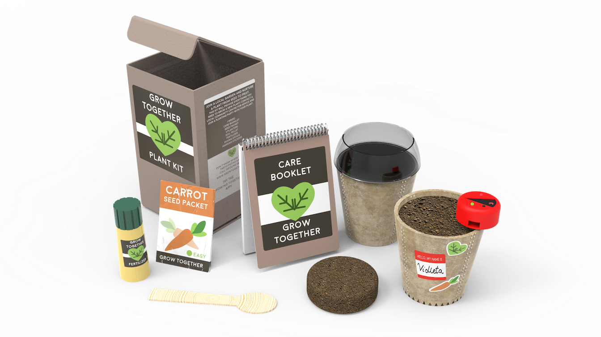

Loneliness is a significant problem in the UK, with nearly a third of people feeling lonely often. Young people and elderly are especially affected. Grow Together is an indoor gardening programme aiming to bring urban communities together and teach new skills as a way of increasing resilience to loneliness.
The project was developed starting from the questions 'How can technology be used to reduce negative effects of loneliness?". Human centred methods were employed at every stage to explore the problem and develop a solution.
