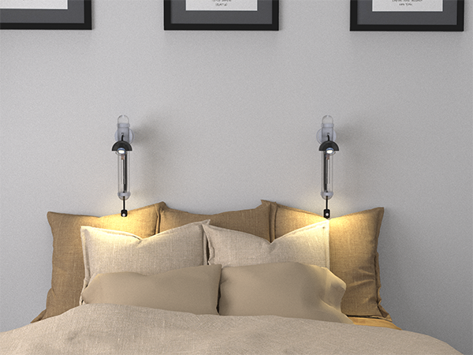

The project proposes a new design process that uses full aesthetic experience as the main design driver. A full aesthetic experience involves all senses and not just visual. The method aims to address the changes that the design field is undergoing due to the development of new, more interactive and adaptive systems due to technology incorporation.

The proposed framework offers guidelines to apply throughout the design process to achieve a full aesthetic experience. The final outcome of applying the methodology is a complete sensory experience (dynamic form, socio-cultural and emotional aesthetic), with an added value to its practical use.

The product used for the case study was a digital alarm clock that will have some integrated technology to enhance the aesthetic interactions (e.g. light or sound). In order to fulfil the principles, the alarm clock was given a goal other than waking someone up. It will invite aesthetic interactions that relate to a specific value, specifically relaxation and content.
