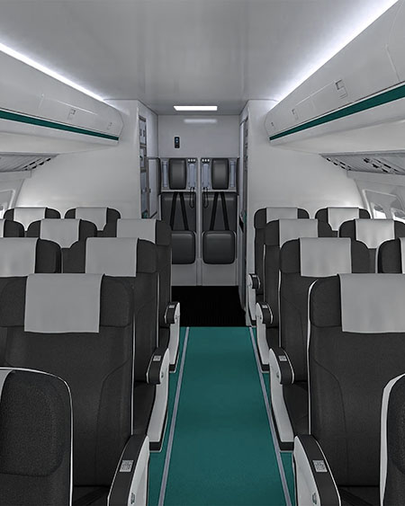

A flight Simulation game in the view of passengers to solve aerophobia. By exposing the player to the anxiety-eliciting scenarios, allow the user to immerse and pratise in the virtual environment thus perform better during the real flight.
