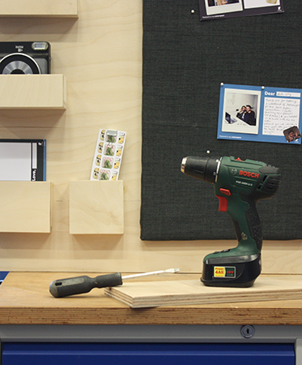

Makerspaces are publicly accessible workshops offering manufacturing technologies and electronics tools to anyone. Makecom is a toolkit to help build the community around makerspaces by triggering and facilitating interactions between staff and new members. The toolkit is comprised of a booklet, and a (roughly) 1mx2m community board.
