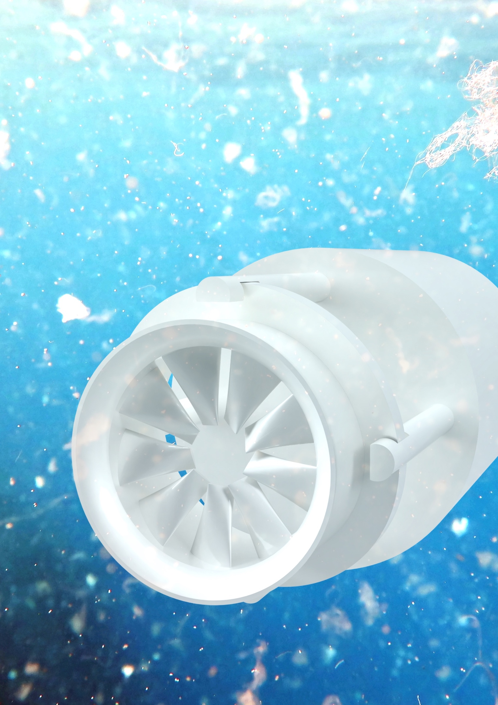

## Introduction
Marine plastic pollution has gained increasing social awareness. A study in 2016 concludes that there are 700 species of animals and fish have eaten ocean plastic. Currently, there are companies tackling the problem of microplastic pollution in the ocean, but the challenge of cleaning microplastics remains. The project is about developing technology to filter and collect microplastic debris in the marine environment. The proposed engineering design aims to be completely passive (i.e. does not require external energy) and friendly to marine animals.
