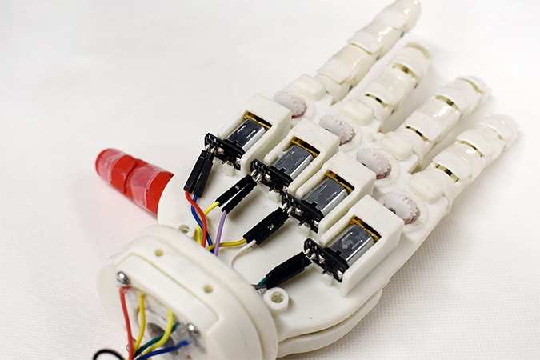

Robotic prosthetic hands, while having shown significant progress in affordability, typically suffer from limited repairability, specifically by the user themselves. In our paper, we propose the OLYMPIC (Operationally Modular Prosthetic), a customisable prosthetic hand with finger and wrist level modularity. The hand utilised a novel mechanical coupling and transmission system to facilitate removal and attachment of the finger and wrist modules without need for tendon or wiring reconnection. The design allows finger, wrist and palm modules to be intuitively and quickly interchanged and assembled by an amputee without need for tools.
