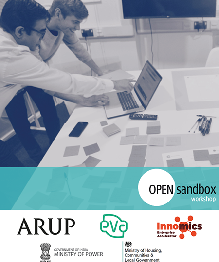

With the Open Sandbox toolkit, the vision is to bridge policymakers, public administrators, local government and private sector city-design stakeholders. The Open Sandbox approach aims to support creating informed tender briefs (challenge briefs), to allow for breadth and scope for design and innovation, towards aligning solutions to better meet citizen needs. Proving the potential scope for scaling into an encapsulating programme for local government and cities.

Open Sandbox’s vision to add to society is introducing a new pre-procurement incubator zone, to the existing public procurement process.
