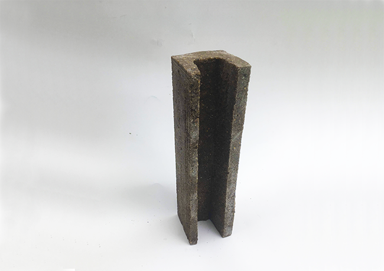

The Polysand Fence is an optimised fence post design made from plastic bonded sand. The design minimises material usage while allowing it to be manufactured using low cost methods. This enhances the value of the material making it commercially viable, while facilitating clean-up projects for areas without waste infrastructure.
