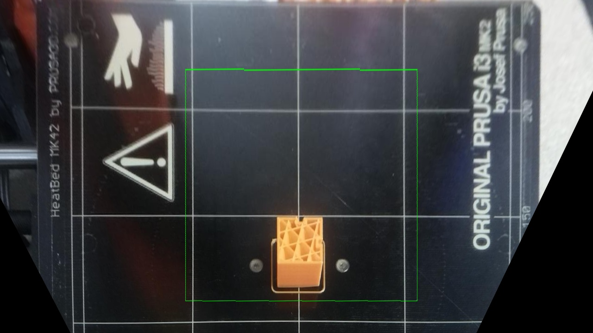

## Introduction

Prosumer additive manufacturing machines (3D printers) enable low-cost benefits to non-technical consumers and organisations. This can be crucial throughout many modern hardware development processes as well as enabling consumers the ability to repair and retrofit their products as necessary without support from the OEM. For many of these stakeholders, professional training, support, and upkeep are not feasible citing costs and time constraints. As such, when these machines fail, which they do often, the users are burdened with a great deal of wasted material, energy and time.

These machines are prone to unreliable performance and unexpected malfunctions which is mostly due to the complexity of the product and lack of intelligent machine feedback. All this is derived from the competitive cost the market aims to deliver to their consumers (at approximately £750 for mid-range quality). Unfortunately, however, most technical advancements to reduce these failures are expensive, and as such a low-cost alternative is necessary.

The equipment used in this project involved commonly used devices in the hacking community, all available at accessible prices.

Indeed, even during the course of this research, there were a number of occasions where the prosumer printer being used failed unexpectedly during a print. Based on experience these were usually down to poor bed conditions or filament change; the cause of such errors however can be as varied as bed temperature fluctuation, bed surface quality, filament quality, blocked nozzles, poor filament feed, complex geometry, inconsistent ambient temperature, various components failures; the list goes on but they can be generally categorised into

1. Detachment, 
2. Object Deformation, 
3. Material Flow, 
4. Surface Errors, 
5. Deviation from Model, and 
6. Mechanical Inconsistency.

## Technique

The method implemented used perspective correction to adjust the image to make it appear like it was viewing the part from the top down. This meant the camera could still be positioned in a useful position for general viewing and timelapses!

First, it needs to be calibrated. To do this we use key markings on the bed that we know the real-world coordinates of.

Then we could warp any image that comes in at an angled perspective, to make it appear flat!

    
    
    
    
    
    

The system used the g-code from the print (the instruction set which tells the printer where to print the plastic) to outline where in the image it is expecting to see the part. This is overlayed on the images below.

	
    

The algorithm compares data collected in different regions of the print. Primarily this is with the top layer of the current print, but it also looks at the immediate viscinity around that top layer. The algorithm follows the following basic flow.

Here are some of the graphs of the output data for different prints (some successful and some with errors).

    
	
    
    

## Evaluation

Evaluation of this methodology has shown a consistently high success rate at detecting errors. Amongst the fourteen trial runs conducted, totalling over 1800 images, there were only two false positives; that's 0.1%! It managed to successfully detect every **detachment** and **material flow** error that was thrown at it.

With these promising results, there is opportunity for this software to be developed into a full open source detection system running on consumer printers around the world.

## Guided Demo

The video below is a guided demonstration of the prototype built for this project.

<iframe src="https://player.vimeo.com/video/343022093" width="640" height="360" frameborder="0" allow="autoplay; fullscreen" allowfullscreen></iframe>
