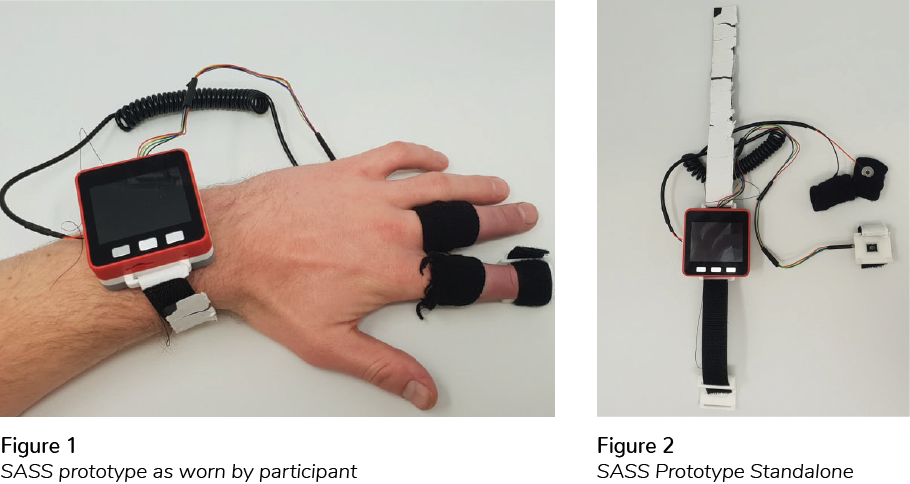

Social Anxiety, commonly known as shyness, is a condition affecting people’s ability to interact with others. There is currently extensive research covering clinical populations on the Social Anxiety scale, but there remains little research on individuals who are less symptomatic and therefore considered subclinical. This project identifies the opportunity to develop a system which can detect and monitor subclinical Social Anxiety. The results of the project highlighted that attention should be directed towards collecting contextual data from smartphones or individuals’ environments, with respect to subclinical Social Anxiety and its physiology.
