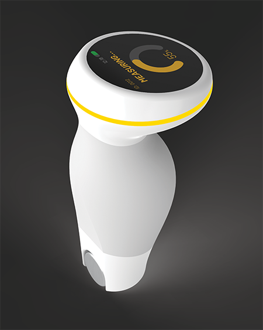

This project entailed the delivery of an accurate, portable human skin friction device design for various potential users considering requirements for performance, ergonomics, use-environment, and industrial design.
