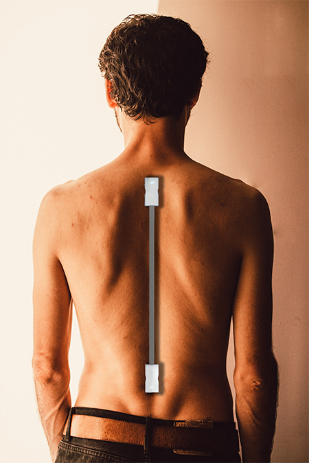

Traditional posture devices use 1 local spinal measurement to estimate the global spine alignment (posture), these methods over-simplify spinal curvature and don't account for physiological variations in individuals. My project seeks to determine two physically measurable metrics from two major landmarks along the spinal cord; the C7 vertebra and the L1 vertebra. Two existing data-sets that include latero-lateral spinal x-rays and a set of physical measurements along the spine are used as the basis for thebezier curve model of the bezier function which estimates thoraco-lumbar spinal curvature. 
