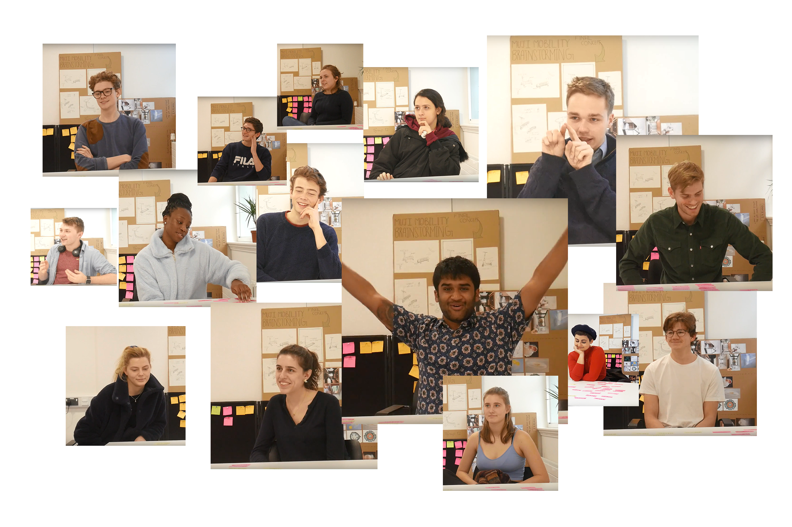

## Context

As a new course at Imperial, Design Engineering as I experienced it was a bit of a mystery to the rest of the university. In this project, I origionally set out to communicate something of Design engineering to them through a physical installation.

## Interviews

However, through interviews with undergraduate Design Engineering students, it was established that the project might have more impact better supporting them as opposed to engaging with the external Imperial community.

## Further Research

In order to better support the students, it was decided to embody their community in a physical installation. Further primary research was carried out in order to better develop possible designs.

## Workshop Induction

The developed design required each student to make an element and add it to the installation for the four years they were on the course. In order to avoid requiring them to make their piece in their own time, it was incorporated into existing workshop inductions each new student is required to undertake.

