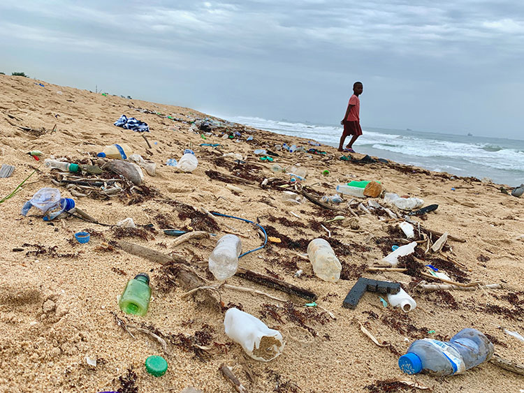

As the world’s population grows, the amount of solid waste we produce grows with it. Our poorest nations are often the ones left to deal with the negative impacts this has. The Upcycle Initiative is a scheme designed for less economically developed countries to benefit from the plastic solid waste that is currently being produced. It introduces a process to collect, sort and upcycle old plastic waste into new and valuable products that will financially and socially benefit the local population.  
